**Flow2API反代无限次数的Banana Pro**

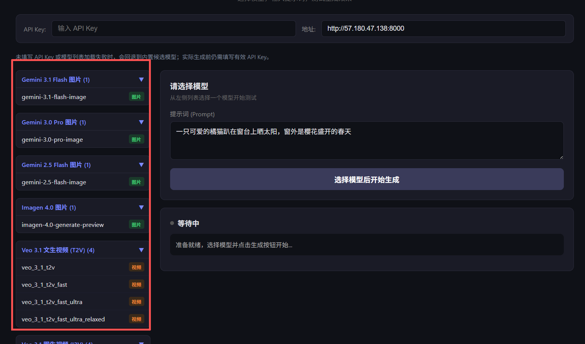

它主打的是账号池、负载均衡、代理支持、自动刷新 token，还有一个网页后台，偏向自己部署后统一管理调用的玩法。

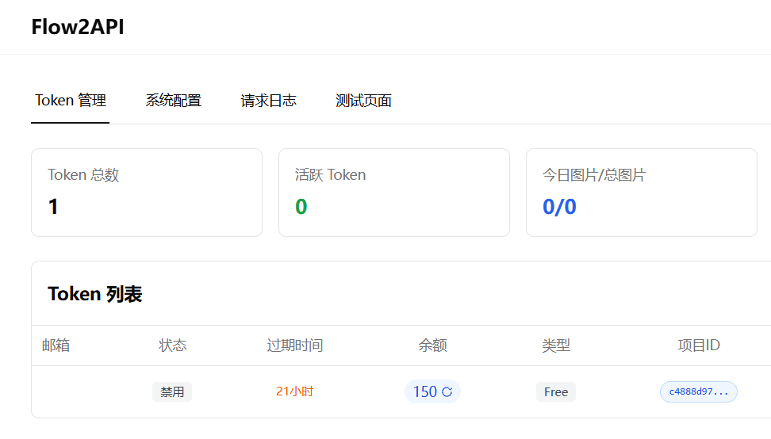

因为打码和ip的问题，最后图片生成失败了，只能是演示安装过程

推荐服务器部署，不要选择国内地区，选择Linux版本Docker上手快

腾讯云新加坡，硅谷，东京地区价格是199元一年，2核4G30M带宽，60GBSSD盘 1.5T月流量，推荐硅谷地区CN2线路↓↓↓，系统选Ubuntu

购买地址：https://curl.qcloud.com/oyWDLkRJ


**教程**

1.Ubuntu24系统安装Docker

```
sudo apt update
sudo apt install -y ca-certificates curl gnupg
sudo install -m 0755 -d /etc/apt/keyrings
curl -fsSL https://download.docker.com/linux/ubuntu/gpg | sudo gpg --dearmor -o /etc/apt/keyrings/docker.gpg
sudo chmod a+r /etc/apt/keyrings/docker.gpg
echo \
"deb [arch=$(dpkg --print-architecture) signed-by=/etc/apt/keyrings/docker.gpg] https://download.docker.com/linux/ubuntu \
$(. /etc/os-release && echo "$VERSION_CODENAME") stable" | \
sudo tee /etc/apt/sources.list.d/docker.list > /dev/null
sudo apt update
sudo apt install -y docker-ce docker-ce-cli containerd.io docker-buildx-plugin docker-compose-plugin
sudo docker run hello-world
```

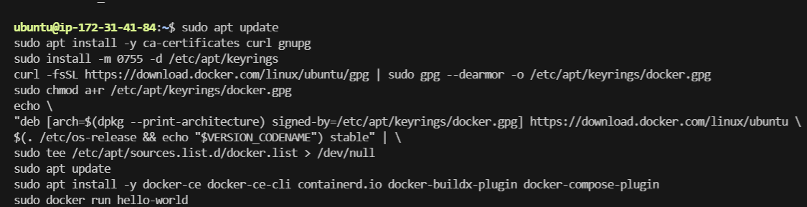

2.下载项目

```
git clone https://github.com/TheSmallHanCat/flow2api.git
cd flow2api
```

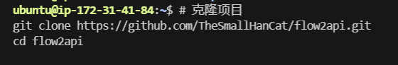

3.Docker 部署项目

```
cd ~/flow2api
sudo docker compose -f docker-compose.headed.yml up -d --build
sudo docker compose -f docker-compose.headed.yml logs -f
```

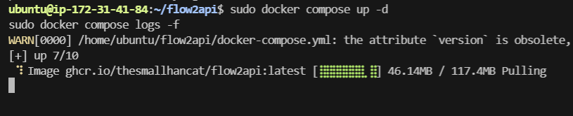

4.浏览器访问管理后台: 

http://localhost:8000

用户名: admin
密码: admin

登录后建议立即修改密码

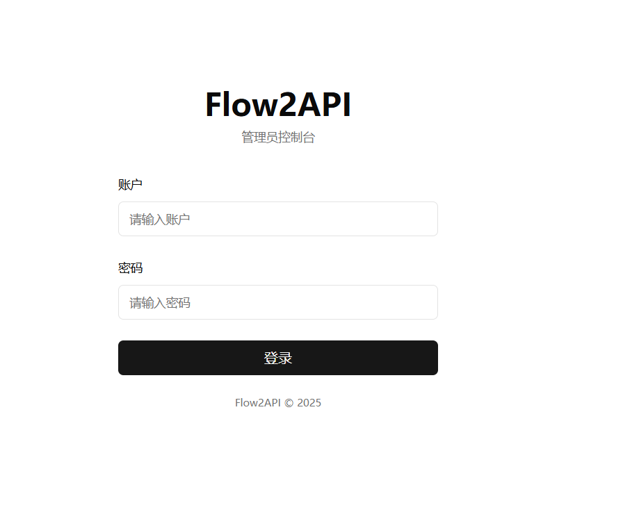

5.去下载项目配套的 Flow2API-Token-Updater 插件

https://github.com/TheSmallHanCat/Flow2API-Token-Updater

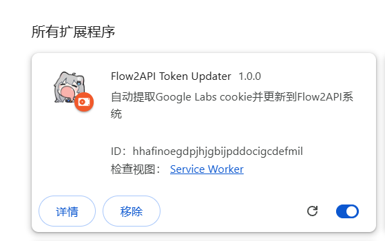

6.配置插件

去项目系统设置复制插件接口和token

配置号之后会自动同步https://labs.google/ 的信息到项目

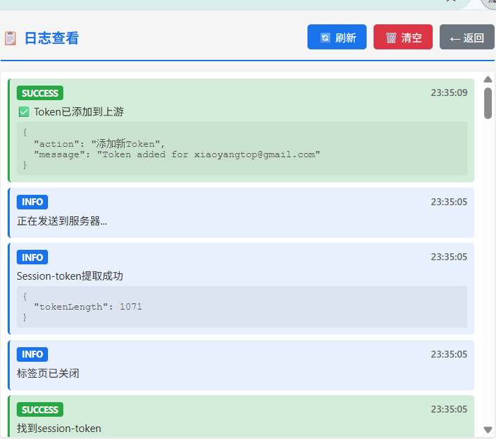

7.项目这边也有同步出现账号信息

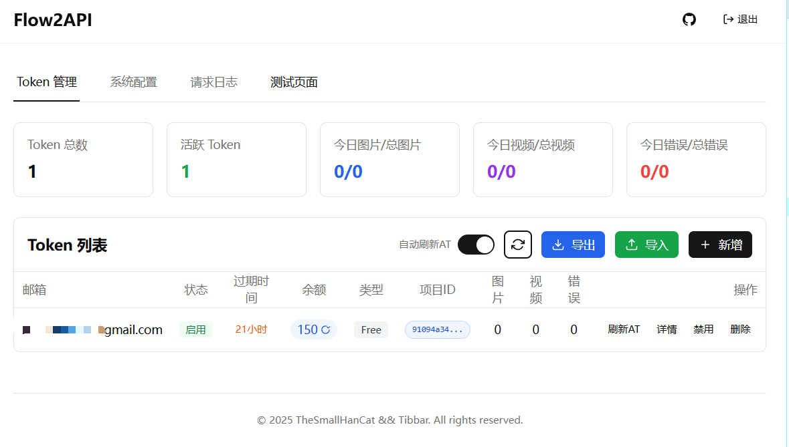

8.验证码配置

去这个网站配置：https://yescaptcha.com/dashboard.html

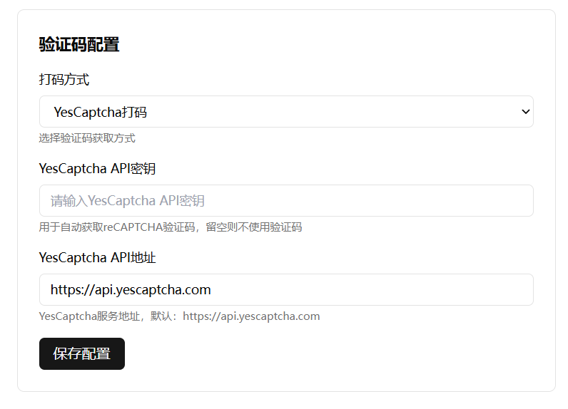

8.测试Gemini 官方 generateContent（文生图）

模型: gemini-3.1-flash-image

接口：http://57.180.47.138:38000

失败了，风控过不去，一般失败是打码和ip的问题，可以轮流换一个打码应该可以成功

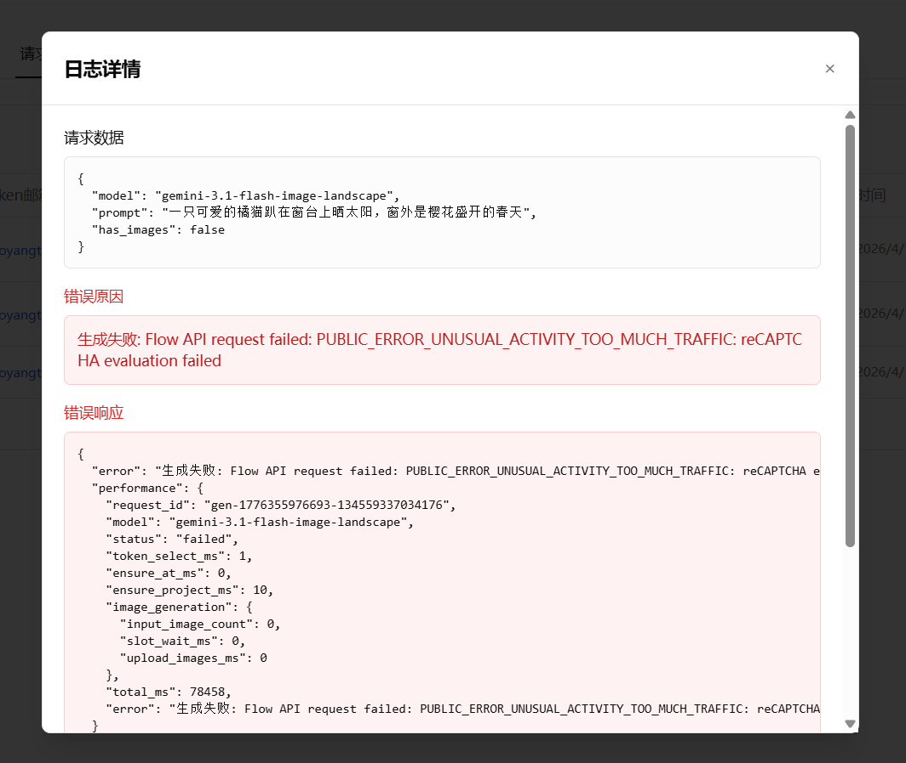


